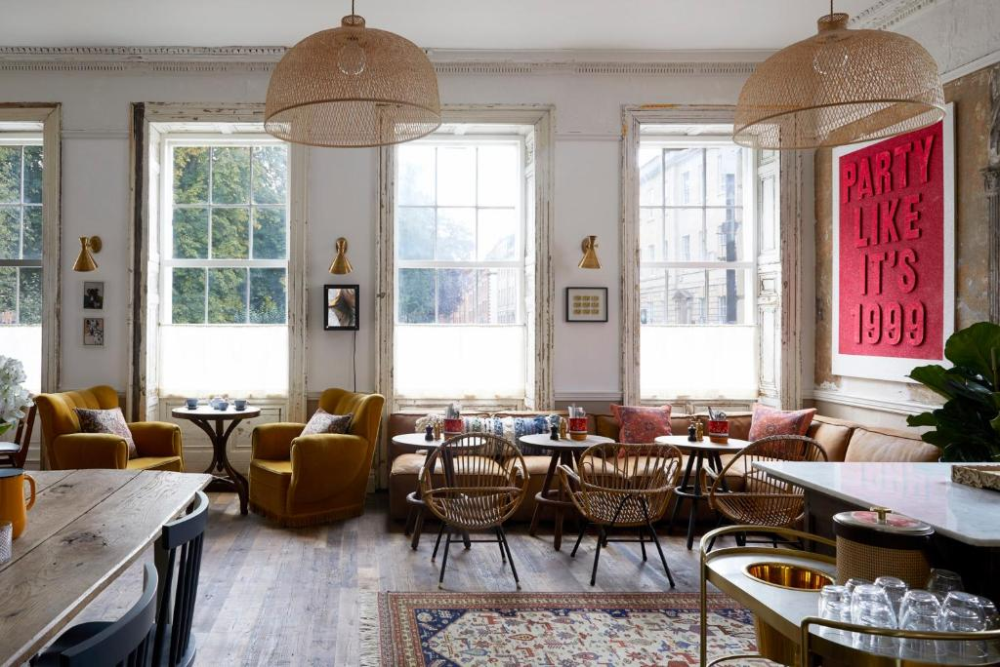
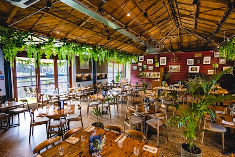
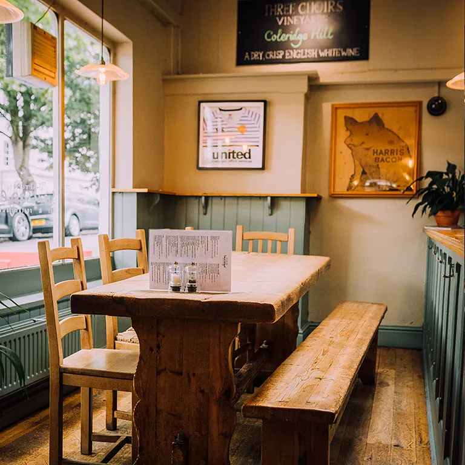

### The Bocabar

https://bristol.bocabar.co.uk/

Menus

https://bristol.bocabar.co.uk/menu

Opening Hours: 12:00 – 9.30pm

Sometimes quite busy / Has baby changing facilities

### Artist Residence 

https://www.artistresidence.co.uk/bristol

Menus 

[Lunch](https://www.artistresidence.co.uk/s/Lunch-Menu-_-Bristol.pdf)
[Dinner](https://www.artistresidence.co.uk/s/Dinner-Boot-Factory.pdf)

Opening Hours: Sunday 8am - midnight
Sunday Lunch: 12:30-4pm

Needs reservation / Dont know if has baby table but listed as babies welcome

### Bank Restaurant

https://www.bankbristol.com/

Opening Hours: Sunday 12:00 - 19:00

Needs reservation / Dont know if has baby table but listed as family friendly

### The Granary

https://www.granarybristol.com/

Menus

[All Day](https://cdn.prod.website-files.com/6528016f398bd08731c95c8c/66913aba7b471a8615cd2d6f_TheGranary_AllDayMenu_AW_0624.pdf)

Opening Hours: 8am – 10pm

Needs reservation / Don't know if has baby table but listed as family friendly

### The Clifton Sausage

https://cliftonsausage.co.uk/

Menus

[Standard](https://cliftonsausage.co.uk/wp-content/uploads/2024/10/ALC_Oct24_Combo.pdf)
[Sunday Lunch](https://cliftonsausage.co.uk/wp-content/uploads/2023/10/sample_sunday_lunch.pdf)

Opening Hours: 12pm to 11pm

Needs reservation / Don't know if has baby table but listed as family friendly / Limited pescatarian menu and limited menu in general (2 dishes on Sunday I think)